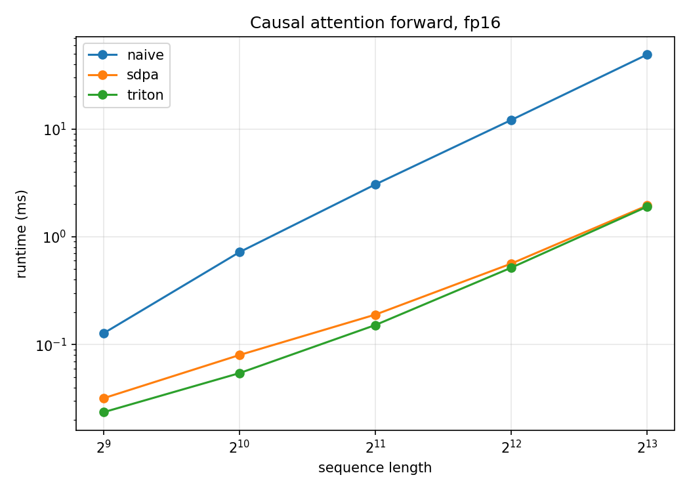
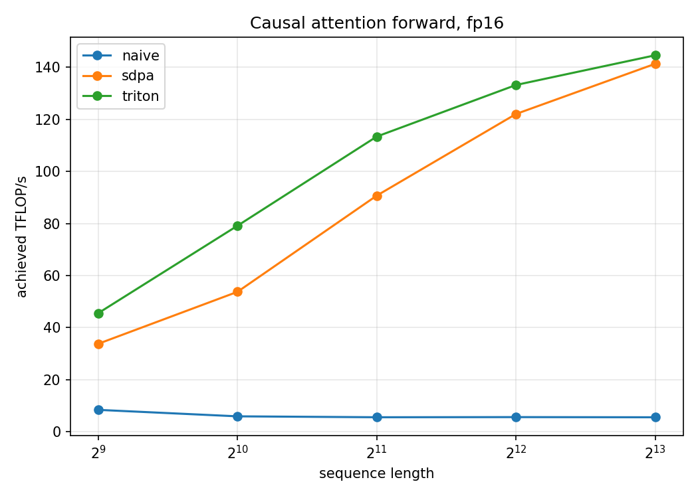
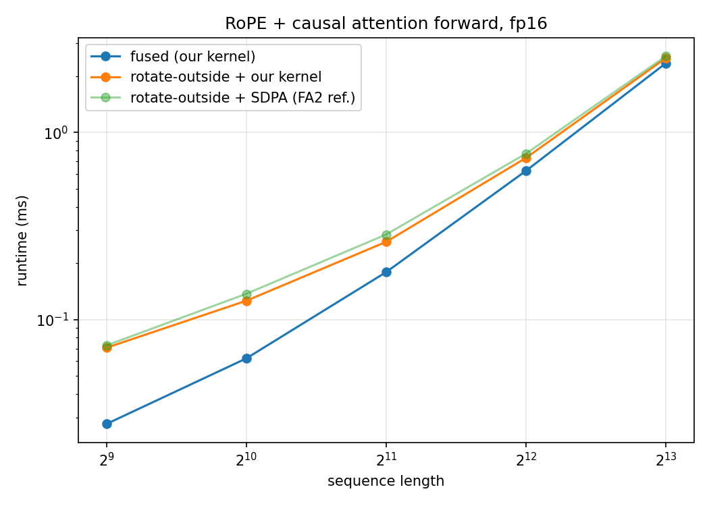

# flash-attention-triton

I wrote a FlashAttention 2 forward-pass kernel in [Triton](https://triton-lang.org/), with fused RoPE and causal masking, to understand the algorithm at the hardware level.

When I ran the benchmarks on an RTX 4090, the kernel hit ~145 TFLOP/s at N=8192, which is about 88% of the fp16 tensor-core peak, and matches PyTorch's FA2 backend.

---

## Blog posts

I wrote two posts going through everything:

- [Part 1: The Memory Wall and the Online Softmax Trick](https://navneetkanna.com/blog/fa_1/): why naive attention is bandwidth-bound, how the streaming softmax recurrence works, and how FlashAttention fuses the output accumulation to stay in SRAM.
- [Part 2: From the Algorithm to a Real Kernel, and Fusing RoPE](https://navneetkanna.com/blog/fa_2/): the Triton programming model, the base kernel, causal masking with an early-stop optimisation, two bugs I hit while fusing RoPE, and a full benchmark.

---

## Main files

- **`fa_base.py`**: the base forward kernel. It streams K and V tile-by-tile through SRAM without ever writing the full N×N score matrix to HBM. Uses `exp2` instead of `exp` (cheaper hardware instruction), causal masking, and an early-stop that skips any K block the current query can't attend to yet.
- **`fa_rope.py`**: the RoPE-fused version. Q is rotated once before the K loop; K is rotated on each iteration. I had to implement the rotation as two half-width matmuls because Triton doesn't allow us to slice a loaded tile. The post covers both bugs in detail.
- **`benchmark.py`**: the timing code I used. Runs naive PyTorch, `torch.scaled_dot_product_attention` (dispatches to FA2 in fp16), and both Triton kernels; outputs markdown tables and plots.

---

## Benchmarks

I ran everything forward-pass only, causal, **fp16** (fp32 accumulation), on an RTX 4090, with B=2, H=16, D=64. Timing uses `triton.testing.do_bench` (25 warmup, 100 measured, median). FLOPs are counted as 4·BHN²D, halved for causality.

**Runtime (ms)**

| seq_len | naive  | sdpa (FA2) | ours (triton) |
|---------|--------|------------|---------------|
| 512     | 0.127  | 0.032      | 0.024         |
| 1024    | 0.719  | 0.080      | 0.054         |
| 2048    | 3.056  | 0.189      | 0.152         |
| 4096    | 12.104 | 0.563      | 0.516         |
| 8192    | 48.970 | 1.946      | 1.902         |



**Achieved TFLOP/s**

| seq_len | naive | sdpa (FA2) | ours (triton) |
|---------|-------|------------|---------------|
| 512     | 8.5   | 33.8       | 45.6          |
| 1024    | 6.0   | 53.8       | 79.1          |
| 2048    | 5.6   | 90.7       | 113.4         |
| 4096    | 5.7   | 122.0      | 133.2         |
| 8192    | 5.6   | 141.3      | 144.6         |



The naive baseline sits flat near 5-8 TFLOP/s regardless of sequence length. It's completely bandwidth bound because it writes and re-reads the full N×N score matrix from HBM. The Triton kernel peaks at 144.6 TFLOP/s at N=8192. It's ahead of SDPA in the mid-range (at N=2048 and at N=4096), most likely because FA2 is tuned for the training/backward case and carries some dispatch overhead.

**Effect of the causal early-stop**

The single optimisation that made the biggest difference was stopping the K loop at the current query block's diagonal instead of always looping to N:

| seq_len | without early-stop | with early-stop |
|---------|--------------------|-----------------|
| 512     | 45.6               | 45.6            |
| 1024    | 63.6               | 79.1            |
| 2048    | 74.9               | 113.4           |
| 4096    | 78.3               | 133.2           |
| 8192    | 78.8               | 144.6           |

Without it the kernel plateaus around 78 TFLOP/s. With it, throughput nearly doubles at long sequences, because without the early-stop, every query block was still computing scores for future K blocks and then immediately masking them to -inf.

**RoPE fusion (ms)**

| seq_len | rotate-outside + SDPA | rotate-outside + our kernel | fused (our kernel) |
|---------|-----------------------|-----------------------------|--------------------|
| 512     | 0.073                 | 0.071                       | **0.028**          |
| 1024    | 0.137                 | 0.126                       | **0.062**          |
| 2048    | 0.285                 | 0.260                       | **0.179**          |
| 4096    | 0.770                 | 0.731                       | **0.623**          |
| 8192    | 2.554                 | 2.486                       | **2.344**          |



Fusing wins at every sequence length. The speedup decays from N=512 to N=8192 because the re-rotation of each K block on every query-block iteration grows with N, but the savings from skipping the HBM round-trip dominate throughout.

---

## Setup

**Docker**

```bash
docker build -t fa-triton .
docker run --gpus all --rm -it fa-triton bash
```

**uv**

```bash
uv sync
uv run python benchmark.py
```

Needs CUDA 12+, Triton support (tested on RTX 4090), Python 3.11+.

---

## Running

**Standalone Script**

```bash
python fa_base.py --dtype bf16
python fa_rope.py
```

**Benchmark**

```bash
# prints markdown tables, saves runtime_vs_seqlen.png, tflops_vs_seqlen.png, rope_runtime_vs_seqlen.png
python benchmark.py --dtype bf16 --batch 1 --heads 32 --head_dim 64 --seqlens 512 1024 2048 4096 8192
```

---

## File structure

```
fa_base.py              forward kernel with no RoPE, at the bottom I have explained using an actual example
fa_rope.py              forward kernel with fused RoPE, same as above, explained using an actual example
benchmark.py            timing and correctness
assets/                 benchmark plots (generated by benchmark.py)
understanding_triton/   practice code i used for learning triton, contains commentes that explain some important things learnt
Dockerfile
pyproject.toml
```

---

## What's next

1. The forward pass now sits at ~88% of peak.
2. Next is the backward pass.
3. An `ncu` profile to confirm why the RoPE fusion margin decays at long sequences, and extended RoPE for long context.
